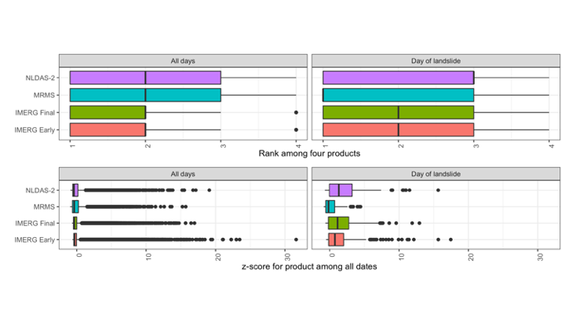
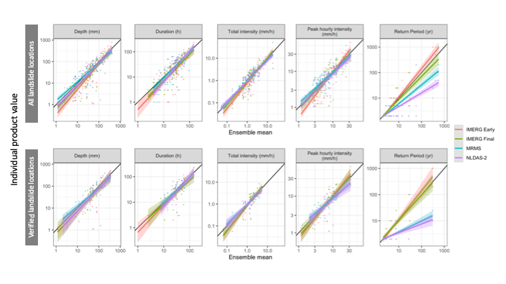

# Introduction

In spite of the destructive nature of landslides, these events remain challenging to forecast [@kirschbaumSatelliteBasedAssessmentRainfallTriggered2018]. There are many sources of uncertainty that contribute to poor landslide predictions such as soil property, vegetation, and anthropogenic modifications to surface and subsurface soil structure. Perhaps the largest source of uncertainty in landslide probability estimates, is hydrologic uncertainty, here defined as uncertainty in the depth and intensity of liquid precipitation leading up to the event [@chowdhuryUncertaintiesRainfallinducedLandslide2002]. A confounding factor is the wide range precipitation datasets ranging from in situ observations, ground-based radar and remotely sensed  retrievals. The goal of this analysis is to investigate the role of precipitation uncertainty and subsequently the uncertainty in landslide risks. A greater understanding areas of relative agreement and divergence across products may provide guidance to practitioners and researchers choosing precipitation products for studying landslides.

## Precipitation sensors and estimates

The precipitation products chosen for this inter-comparison represent three broad categories of precipitation measurements as their primary component: precipitation gauges, ground-based radar, and microwave satellite. Precipitation gauges operate by periodically measuring how much precipitation has landed in a bucket. Their main strength is they directly measure the amount of water that lands in the bucket, but nonetheless they suffer from spatial and temporal inconsistencies as a result of wind [@pollockQuantifyingMitigatingWindInduced2018], instrument design [@duchonUsingHighSpeedPhotography2014, @duchonUndercatchTippingbucketGauges2010], poor instrument placement [@voseImprovedHistoricalTemperature2014], lack representativeness of the surrounding area, and global sensor density [@kiddHowMuchEarth2017]. Ground-based radar can detect precipitation based on propagation and backscatter of radar, and therefore can detect variation in precipitation potentially hundreds of kilometers away. Like any indirect measurement of precipitation, radar must convert the radar signal to precipitation volume and to remove the influence of other objects from buildings or insects in the radar's path [@fornasieroImpactCombinedBeam, @bousquetObservationsImpactsUpstream2003, @nikahdReviewUncertaintySources2016]. Most ground-based radars use multiple bands of radar and multiple polarities in order to compute the  raindrop shape and size distributions used in the processing, which is an advantage of ground-based radar over many satellite sensors [@chandrasekarPOTENTIALROLEDUALPOLARIZATION2008]. Satellites can use any of a number of sensors to detect precipitation including active and passive microwave, infrared, radar, or any combination, and they can also be deployed in geostationary or low Earth orbits that cover particular regions at particular intervals. The key advantage of satellite-based precipitation measurements is that unlike ground-based sensors they can provide frequent, spatially homogenous, global precipitation measurements, although typically multiple satellites are required to develop such a product [@tapiadorGlobalPrecipitationMeasurement2012]. However, since each type of satellite-based sensor has its own set of strengths and weaknesses that are beyond the scope of this study, many of the challenges of satellite-based precipitation measurement are related to sensor calibration, bias-correction relative to ground-based measurements [@ebertMethodsVerifyingSatellite2007], and the development of algorithms for merging measurements from diverse sources [@huffmanTRMMMultisatellitePrecipitation2007].

## Precipitation datasets for forecasting or nowcasting landslides

Though precipitation measurements have been compared on the basis of any number of metrics in prior studies ranging from annual totals to the largest number of consecutive dry days, in this study the choice of metrics was guided by what might be useful to researchers and practitioners interested in forecasting and responding to rainfall-triggered landslides. 

While some landslides are triggered by short, intense precipitation events, others are triggered by the complete saturation of the soil column that occurs over a longer period of time [@cannonWildfirerelatedDebrisFlow2005]. However, in both of these cases the triggering event occurs over the course of hours or days rather than months or years, and for some landslides the critical time period may be less than an hour of intense rainfall. As a result, we selected precipitation products with hourly or finer temporal resolution (see @sec:precip_data) and evaluated them over individual storm events. Satellite products tend to capture the higher-intensity precipitation [@sunReviewGlobalPrecipitation2018] that can be key in triggering landslides. This may be due to the measurement method or the generally higher temporal resolution of satellite products.

When precipitation is used to provide warning systems or guide recovery efforts from landslides, it is important to be able to provide that information in a timely manner [@kirschbaumAdvancesLandslideNowcasting2012]. Low latency is therefore vital in a precipitation product used to forecast or nowcast landslides. This study also will assess whether the low latency comes at a cost relative to landslide forecasting  skill for the selected products.

Finally, many precipitation products struggle in mountainous regions [@sunReviewGlobalPrecipitation2018], precisely where landslides are most likely to occur due to higher slopes. This study includes an analysis in the spatial variation in performance to assess the role of topography in the results.

## Precipitation product comparisons

@sunReviewGlobalPrecipitation2018 reviewed 30 gauge-based, satellite-based, and reanalysis global precipitation products, comparing annual precipitation estimates, 90th percentile of daily precipitation, systematic and random error for daily precipitation, and regional differences in performance. They found a great deal of variability even within the same class of product (e.g. a deviation of 300 mm in annual precipitation for some). They conclude that cross validating across multiple datasets is crucial to account for errors, and that the placement and density of gauges accounts for many of the errors in gauge-based or gauge-corrected products. 

@adlerIntercomparisonGlobalPrecipitation2001 similarly analyzed 31 gauge-based, satellite-based, model-based, and climatological datasets, comparing monthly precipitation, precipitation by latitude, and inter-annual change.  They found that 'quasi-standard' products, e.g. those like the Global Precipitation Measurement mission (GPM) [@houGlobalPrecipitationMeasurement2014] that have undergone substantial testing, perform better. Additionally, they found that products incorporating both in situ and satellite information (e.g. the Global Precipitation Climatology Project [GPCP] [@adlerVersion2GlobalPrecipitation2003]) perform better than products based on a single data source.

## Inter-comparison of extreme precipitation

Fewer studies comparing extreme precipitation exist [@amitaiMultiplatformComparisonsRain2012, @manzanasPrecipitationVariabilityTrends2014, @hashmiComparisonSDSMLARSWG2011, @tryhornComparisonTechniquesDownscaling2011], primarily looking at extreme precipitation indicators like 90th percentile precipitation, extreme one-day precipitation and maximum number of consecutive wet days. These measures are meant to capture large storms that happen on at least an annual basis rather than storms that rise to the level of a natural disaster [@sunReviewGlobalPrecipitation2018; @manzanasPrecipitationVariabilityTrends2014]. Because this study is focusing on rainfall-triggered landslides, it will focus instead on the total storm depth, duration, average intensity, and peak intensity of precipitation events known to precede landslides in North America. 

## Intensity-Duration Thresholds for landslide prediction

Intensity-Duration Thresholds are a type of single-parameter statistical model used for landslide early warning systems, where rainstorms above the curve are predicted to cause landslides [@scheevelPrecipitationThresholdsLandslide2017]. The curves are typically valid in a particular region or climate and for a range of durations based on the training data [@guzzettiRainfallIntensityDuration2008]. This study will use a selection of power-law Intensity-Duration Thresholds from those included in a review by @guzzettiRainfallIntensityDuration2008 to preliminarily compare the suitability of precipitation measurements from different sources for providing early warning or near-real time support to disaster response organizations.

Given the wide-ranging issues associated with precipitation observations cited above, as well as the importance of understanding and anticipating landslide events, this study presents a multi-product, multi-site analysis to understand landslide-triggering storms. We thereby address a gap in the literature when it comes to evaluating extreme precipitation through the lens of natural hazards. This work furthers the analysis by @rossiComparisonSatelliteRainfall2017 who compared gauge and satellite precipitation for the purposes of landslide modeling by additionally including a ground-based radar product and by singling out observations preceding specific landslide events.

In @sec:methods, we will discuss landslide site and precipitation product selection, followed by procedures for splitting precipitation into storms and the metrics used in the comparison. @Sec:results begins with the cumulative precipitation over the 30-days preceding the landslide for 5 characteristic example sites. Next, we compare each product using storm characteristics of total depth, duration, total intensity, peak intensity, and return period. To test whether peak intensity might be accounting for low return period storms causing landslides, we compare the two. Finally, we use established intensity-duration thresholds to test which products have the best separation between landslides and other rainfall, comparing the hit ratio and the false alarm ratio for each product and threshold.

# Methods {#sec:methods}

For this study we compared the precipitation at landslide sites first by examining trends in the variability and bias of landslide-triggering storm characteristics relative to other measurement and then by computing the skill of several established models in predicting landslides using different precipitation products. Rainfall-triggered landslide sites were chosen from the NASA Global Landslide Catalog and verified where possible using satellite imagery (see @sec:site_selection). Next we retrieved precipitation from four different products (see @sec:precip_data) for the landslide locations and the temporal domain of the study. The precipitation time series were split into individual storms, and characteristics of total depth, duration, intensity, peak intensity, and return period were calculated (@sec:compute_storms). Finally, intensity-duration curves were applied and the hit ratios and false alarm ratios were computed for each model-product combination (@sec:compute_idt_scores). 

## Study domain and landslide site selection {#sec:site_selection}

Landslides were selected from the NASA Global Landslide Catalog (GLC) [@kirschbaumGlobalLandslideCatalog2010]. The selection criteria were that the landslides were:

* triggered by rain, downpour, continuous rain, or flooding according to the GLC
* occurred in CONUS or Canada below $60^o$ N after May 2015 so as to have data available in each of the selected precipitation products
* a location with a maximum estimate error of $10$ km according to the GLC

 In total, 228 landslides were selected. Of those landslides, 8 were also verified by manually locating a scarp in satellite images; the remaining landslides could not be verified to have occurred near the location specified by the NASA GLC. @Fig:site_map shows the included sites with the verified sites indicated in white. Many of the sites fall near the West coast, likely due to the many population centers there close to mountainous regions. The verified landslides seem to be spatially distriubuted proportionate to the distribution of the full selection of landslides.

{#fig:site_map}

## Precipitation data sources {#sec:precip_data}

Four gridded precipitation datasets were selected to use this study with the goal of choosing datasets that use three common measurement methods: gauges,  ground-based radar, and satellite. In addition, we focused on products that have undergone extensive verification, with a preference for those that covered at least the continental US at a minimum of hourly measurements and a reasonably high resolution grid among the available sources ($0.125^o$ or finer). Finally, we included products with multiple latencies where available.

### North American Land Data Assimilation System version 2 (NLDAS-2) forcing dataset

The NLDAS-2 forcing dataset is a combination of daily gauge-based National Center for Environmental Prection Climate Prediction Center and hourly radar-based National Weather Service WSR-88D precipitation [@cosgroveRealtimeRetrospectiveForcing2003].  The gauge-based estimates are are disaggregated to hourly using the radar-based estimates, resulting in a real-time hourly gridded product at $0.125^o$ (~$12$ km) resolution across North America going back to 1999 with a latency of approximately 4 days. Though it has low resolution relative to the other precipitation products used here, NLDAS-2 forcing is a gauge-based product that has been extensively validated over more than 20 years of real-time data.

### Multi-Radar Multi-Sensor (MRMS) Quantitative Precipitation Estimate

MRMS precipitation estimates are primarily based on a centralized radar mosaic with 2 minute resolution over the US and Canada. This study uses an hourly version that also integrates data from numerical weather prediction, satellites, gauges, lightning sensors, and precipitation models [@zhangMultiRadarMultiSensorMRMS2015]. While both NLDAS-2 and MRMS estimates contain common information from gauges and radar, the NLDAS-2 product is primarily a gauge-based estimate while MRMS focuses on radar inputs. MRMS is the most recent precipitation product we selected, and so there are relatively few years of data for validation. However, it has by far the highest resolution at $.01^o$ (~1.1 km) and represents the state of the art in terms of leveraging computing resources to take advantage of a multitude of overlapping radar and other types of sensors.

### Global Precipitation Mission (GPM) Integrated Multi-satellitE Retrievals for  Global  (IMERG) precipitation measurement

GPM IMERG precipitation estimates are a combination of multiple satellite measurements, including the GPM Core Observatory Microwave Imager which is considered the standard for other included satellites. In addition to active and passive microwave sensors, IMERG estimates include Infrared sensors, satellite-based radar, and precipitation gauges. The gauges are used for monthly bias correction [@huffmanIntegratedMultisatelliteRetrievals2020a]. There are 3 IMERG products, Early, Late, and Final, of which we use the Early (~4 hour latency) and the Final (~3.5 month latency) in this study. Since IMERG products use the GPM active and passive microwave data as a standard with only monthly gauge-based bias-correction, they are fundamentally different from many other precipitation products available. The Early version also has extremely low latency, making it the most suitable amongh the products explored here for operational landslide modeling provided that it is not significantly weaker in metrics important for landslide detection such as high peak intensities.

| Precipitation product                                        | Description                                                  | Spatial Resolution | Temporal resolution | Typical Latency                    |
| ------------------------------------------------------------ | ------------------------------------------------------------ | ------------------ | ------------------- | ---------------------------------- |
| Integrated Multi-satellitE Retrievals for  Global precipitation measurement (IMERG) early run [@houGlobalPrecipitationMeasurement2014] | Global network of satellites unified by measurements from a single reference radar/radiometer satellite. | $.1^o$ (~10 km)    | 30 minutes          | 4 hours                            |
| Integrated Multi-satellitE Retrievals for  Global precipitation measurement (IMERG) final run [@houGlobalPrecipitationMeasurement2014] | In addition to the satellite data included in the IMERG early run, the final run includes late-arriving microwave overpasses, monthly gauge-based adjustments, and an algorithm that interpolates forward as well as backward in time. | $.1^o$ (~10 km)    | 30 minutes          | 3.5 months                         |
| Multi-Radar Multi-Sensor (MRMS) [@zhangMultiRadarMultiSensorMRMS2015] | Integrates data from radars, satellites, precipitation gages, and other sensors to provide real-time decision support | $.01^o$ (~1.1 km)  | 2 minutes           | < 5 minutes                        |
| North American Land Data Assimilation System version 2 (NLDAS-2) forcing  [@xiaContinentalscaleWaterEnergy2012] | Disaggregation of Climate Prediction Center  daily precipitation using bias-corrected radar | $.125^o$ (~ 12 km) | 1 hour              | 4 days                             |
| NOAA High-Resolution Rapid Refresh (HRRR) model [@alexanderHourlyUpdatedUS2016] | Numerical Weather Prediction with radar assimilation.        | $3$ km             | 1 hour              | 1-36 hour forecasts updated hourly |

: 3 Precipitation products that will be used to characterize the degree of hydrologic uncertainty present immediately before and during landslide events {#tbl:products}

## Precipitation  comparison using storm characteristics {#sec:compute_storms}

For each of the above precipitation products, data were extracted for the nearest grid location between May 2015 (the earliest date MRMS data are available) and May 2020 (the latest release of IMERG Final data). A threshold of 1 mm was applied to the precipitation data to reduce noise. The data were then split into storm events, where a gap of at least 24 hours was considered to be the end of one storm and the beginning of the next. 

For each storm, storm characteristics of depth, duration, intensity, and peak intensity were computed and compared. In addition, the distribution of storm depth, rank, and z-score were computed for the day of the landslide, the full preciptitation record. Storm depth was used to indicate if any particular product had and unusual distribution of precipitation. Rank was chosen as in indicator of the bias of each product relative to the others, and z-score an indicator of the variability of each product relative to the others.

For the landslide-triggering storms, the return period of the precipitation was also computed using the NOAA precipitation atlas frequency estimations [@NOAAAtlasPrecipitation]. In order to determine the highest return period subset of the storm, the maximum precipitation value for each applicable NOAA atlas duration (1, 2, 3, 6, 12, 24, 48, 72, 96, and 168 hours) was extracted. For example, for the 3-hour duration, a running 3-hour precipitation total was calculated for the entire storm, and the maximum of the total chosen to look up in the NOAA atlas. We then selected the maximum return period from among the 10 possible durations for each landslide.

## Precipitation comparison for use in Intensity-Duration Thresholds {#sec:compute_idt_scores}

Intensity-Duration thresholds are simple landslide models whereby a threshold is defined as a power law of the storm duration ($I = a D^-b$), and either raw or normalized intensities above the threshold predict a landslide  [@segoniLandslidesTriggeredRainfall2014]. They have been calculated at multiple scales and climates, including globally [@scheevelPrecipitationThresholdsLandslide2017, @caineRainfallIntensityDuration1980, @kirschbaumAdvancesLandslideNowcasting2012]. Three thresholds for this study [@caineRainfallIntensityDuration1980, @cannonWildfirerelatedDebrisFlow2005, @guzzettiRainfallThresholdsInitiation2007]  were obtained from a review by @guzzettiRainfallIntensityDuration2008. Thresholds were used on applicable subsets of the data based on climate or other conditions. For each threshold-product combination, we computed a hit ratio (correctly predicted landslides over the total number of landslides) and a false alarm ratio (incorrectly predicted landslides over the total number of non-landslides)

# Results {#sec:results}

## Precipitation pre-landslide time series

@Fig:cumulative shows the cumulative precipitation in the 30-days before a landslide at 5 example sites.  The selected sites showcase a variety of ways in which the precipitation from multiple products can differ. For example, while the preciptiation in panel (c) matches closely for all products, in panel (d) there is a wide spread of approximately two-thirds the maximum total amount of precipitation. The preciptiation in panel (e) also demonstrates a factor of 6 spread of precipitation values but appears to be more strongly correlatedthan panes with similar total 30-day depths. In panel (b) the products separate substatially but ultimately the 30-day depth is nearly identical. Panel (a) shows a likely landslide location error since none of the products register any precipitation at all. Note that the difference in depths over a single 30-day period for these multiple categories of precipitation data is on the same order of magnitude as the _annual_ error in depth reported for products of the same category by @sunReviewGlobalPrecipitation2018. This could be because using products from different categories introduces much more variability, or that the large landslide-triggering storms have a greater potential for error by virtue of containing more depth overall than other storms. 

![Cumulative precipitation measurements at selected landslide sites for the 30 days before the event. The precipitation is variable across the different products, and the selected sites each demonstrate diverse types of variability. Panel (a) shows a site where no landslide-triggering precipitation was detected by any product, suggesting a location error in the landslide record. In panel (b), the IMERG Early product reports nearly 50mm less cumulative precipitation leading into the landslide-triggering storm, but then makes up the difference by detecting much more precipitation immediately before the landslide. Panel (c) shows similar measurements among all products while in panel (d) there is a wide spread of approximately two-thirds the maximum total amount of precipitation. Finally, in panel (e) all products are well correlated, but the volumes do not match.](example_landslide_precipitation.png){#fig:cumulative}

## Bias and variability of precipitation products

@Fig:bias_variability shows the distribution of depth, rank, and z-score for day-of-landslide precipitation. The IMERG products tend to have higher rank than MRMS, which typically exceeds NLDAS-2 measurements. IMERG Early has by nearly 300mm the highest precipitation measurements, suggesting that the further interpolation in the Final product smooths out these outliers. The median value for the IMERG product is the largest, however. The z-scores reflect the same order as the rank, further revealing a comparable range of variability across all products and landslide sites. The IMERG products tend to be above the mean while NLDAS-2 and MRMS tend to be below, but the highest and lowest z-score values are similar for all products.

{#fig:bias_variability}

@Fig:scatter shows the storm characteristics for each storm plotted against the ensemble mean value of all the products. Included are values for all the landslide sites and for the verified locations alone. The IMERG products tend to measure higher peak hourly intensities, which is likely at least partially due to the shorter 30-minute time step. However, the higher peak intensities are more clearly reflected in longer return periods, which are based on hourly durations at the shortest. MRS and NLDAS-2 seem to have even lower return periods among the verified locations, suggesting that these products have difficulty detecting high return period precipitation consistently.

In general there appears to be good agreement among products on the depth and duration of storms, with the exception of outliers below 10mm of total depth. Among the verified locations, there are fewer low depth or duration values that are either outliers or near to the mean, suggesting that low measurements may be due to variation in precipitation within the range of the location error. 

{#fig:scatter}

Most of the landslide-triggering storms had very low return periods of less than 2 years according the NOAA atlas. One possible explanation is that large peak intensity values cause landslides even as part of a relatively low return period storm. @Fig:peak_intensity investigates this hypothesis, showing a clear trend of increasing peak intensity with return period. Finer temporal resolutions would be necessary to truly test this hypothesis, since for MRMS and NLDAS-2 the shortest storm duration is also the same as the product resolution. Peak hourly intensities high enough to cause a landslide amidst otherwise ordinary precipitation should show up as a high return period ordinary storm.

{#fig:peak_intensity}

@Fig:intensity_duration shows the precipitation on intensity/duration axes with three intensity-duration thresholds plotted over them, and @tbl:threat summarizes the performance of each threshold. The choice of threshold does not appear to make a large difference in this context, since the models are very similar when compared to the variation in precipitation data across sites and among products. These models tend to perform better using MRMS or NLDAS-2 data than using either IMERG product, with hit ratios of 0.88 and 0.76 rather than 0.70 and 0.68 among the verified landslide locations. All products perform better when using only the verified landslide sites.

There is a concentration of long-duration, low-intensity storms for all products that is likely the result of the storm identification algorithm. It appears that many of the threshold misses (landslides not identified by the threshold) fall into this section of the data, suggesting that improvements to storm delineation might boost threshold performance for all products but especially for the IMERG data.

{#fig:intensity_duration}

| Product         | Include  | **Hits** | **Misses** | **Hit ratio** | **False alarm ratio** |
| --------------- | -------- | -------- | ---------- | ------------- | --------------------- |
| GPM IMERG Early | All      | 114      | 62         | 0.6477273     | 0.2694975             |
|                 | Verified | 44       | 21         | 0.6769231     | 0.2980977             |
| GPM IMERG Final | All      | 117      | 60         | 0.6610169     | 0.3074026             |
|                 | Verified | 45       | 19         | 0.7031250     | 0.3389533             |
| NLDAS-2         | All      | 114      | 40         | 0.7402597     | 0.2213864             |
|                 | Verified | 45       | 14         | 0.7627119     | 0.2228354             |
| MRMS            | All      | 130      | 26         | 0.8333333     | 0.2433511             |
|                 | Verified | 52       | 7          | 0.8813559     | 0.2635528             |

Table: Threat score, hit ratio, and false alarm ratio for each product and the @guzzettiRainfallThresholdsInitiation2007 Intensity-Duration Threshold {#tbl:threat}

## Resolution

### Do products produce comparable results when compared at equal temporal and spatial resolution, or are there other underlying differences?

* FIGURE 8: Scatter volume, intensity, frequency, and peak intensity for each product with matched temporal resolution

# Discussion

Among the precipitation products chosen for this study, both IMERG products identify both higher peak intensities and return periods. They also detecting more anomalously low precipitation values.  Low-intensity precipitation in all products was associated with long durations (see @fig:intensity_duration), which may occur because of noise slightly above the 1 mm threshold extending the computed duration of the storm and reducing its overall intensity. As a result, it appears that while every product could benefit from a storm delineation process that prevented the intensity from being diluted, the IMERG products were particularly vulnerable to the identification of long-duration low-intensity storms as a result of the method used in this study to separate storms. Those long-duration low-intensity storms tended to bring the hit ratio down for the intensity-duration thresholds. It is possible that many of the long-duration low-intensity precipitation events  could be effectively filtered out by using a different storm delineation algorithm. Since the IMERG products both were able to identify higher intensity precipitation than the other products, it is possible that they would in fact perform better for identifying landslides if the low-intensity storm problem could be mitigated.

Using Intensity-Duration Thresholds performed reasonably well at identifying landslides particularly considering that they were trained over large regions using different sources of precipitation data to those used in this study. However, they fared more poorly at excluding false alarms using these data. Since there are many other factors that can influence landslide occurrence such as topography, soil type, recent wildfire or disturbance, or infrastructure placement, some of the high-intensity precipitation that did not cause landslides simply may not have fallen on locations that were susceptible. A landslide’s location in a highly susceptible location could also affect the ability of a threshold to detect the landslide, since high susceptibility would mean less intense rain would be required to trigger the landslide. Even the 1.1 km resolution of the MRMS data could contain a great deal of variation in landslide susceptibility within and individual grid cell. Nonetheless, the reliance on ground-based sensors seems to have been as much of a factor as resolution to the performance of Intensity-Duration Thresholds in identifying landslides; the second-best model performace was using NLDAS-2 data. This could be due to the storm identification challenges mentioned above disadvantaging the IMERG data or because IMERG data are fundamentally less suited to landslide identification due producing a distribution that is erroneously heavy on the low end.

Though MRMS and NLDAS-2 are also low latency products, in the case of IMERG the low latency seemed to come at a cost of an exaggeration of the weaknesses and strengths of IMERG in identifying landslides. In particular, IMERG Early had the most low storm intensities, and so  performed the worst at landslide identification. Without changes to the precipitation processing, the low latency does indeed appear to be a liability in this case.

Precipitation measurements at verified landslide sites tended to be higher than those at other sites, suggesting that the actual landslide location was too far away from the recorded location for the precipitation measurements to be representative for some of the landslides with larger location errors. The intensity-duration thresholds similarly performed better at verified locations only for all precipitation products.

# Conclusion

The precipitation products chosen for this study differed greatly in measurement values for the same time and location, particularly during the extreme events resulting in landslides. As a result, the precipitation products differed in their ability to predict landslides. A particular challenge was the presence of low-intensity, long-duration storms triggering landslides. This challenge could potentially be addressed by better filtering and aggregating the data into storms. Nonetheless, the choice of precipitation product affected landslide intensity-duration threshold performance with the present processing technique, with the products that relied on ground-based sensors having a more easily identifiable landslide signal despite generally recording lower peak intensities and return periods. Though it was hypothesized that peak intensity would be an important predictive factor, the results suggest intead that a lack of noise on the low end may be more important for accurate landslide identification. 

Using the methods of this study, those practitioners attempting to use intensity-duration thresholds as operation landslide models would do well to select a product like MRMS that has extremely low latency and performs well at identifying landslides. None of the products was particularly good at filtering out false alarms of landslides. A model that takes into account landslide susceptibility has the potential to reduce false alarms.

A major limitation to studies like this is the lack of exact and verified landslides locations, as reflected in the results for exact landslide locations as compared to inexact locations. This can be addressed by a manual search as in this study or perhaps in the future by machine learning.

# Bibliography